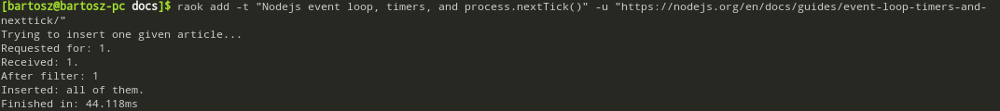
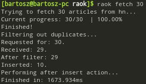
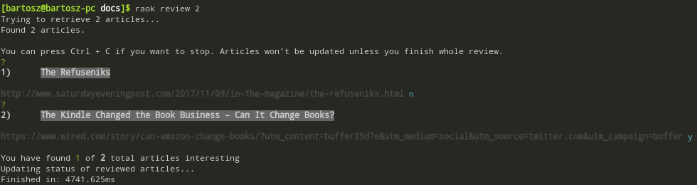
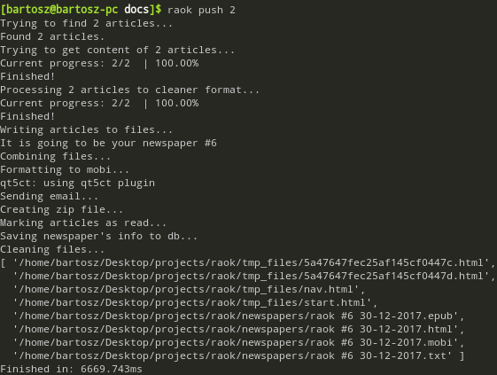
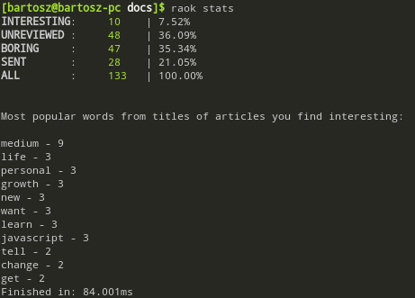
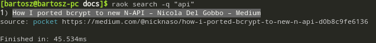
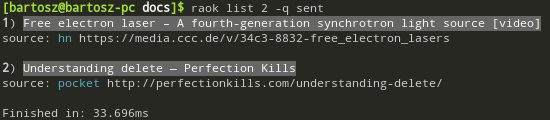

# raok

read articles on kindle

**raok** is a command-line tool that aims to handle news overload problem.

The project reduces amount of time I compulsively scroll through Hacker News or other news pages as well as the time spend staring at the screen of computer or smartphone. It allows me to have dedicated time to read articles I consciously chosen, on the device adapted to reading. Additional value comes from some interesting facts I can retrieve from my activity - I like numbers!

In order to run **raok**, you must have [pandoc](http://pandoc.org/), [calibre](https://calibre-ebook.com/), [mongodb](https://www.mongodb.com/) and [node & npm](https://nodejs.org/en/) installed on your Linux machine.

## Setup

Instead of launching `mongod` every time you boot your machine, it may be convienient to have a cron job that does it for you.

Create **run_mongodb_locally.sh** file with following content (of course you can choose different port).

```bash
#!/usr/bin/env bash

nohup mongod --port 27000 &
```

Make it executable.

```console
$ chmod u+x /path/to/run_mongodb_locally.sh
```

Edit crontab file.

```console
$ crontab -e
```

Append line.

```console
@reboot /path/to/run_mongodb_locally.sh
```

Clone this repo and cd to id and then run the command below.

```console
$ npm i -g
```

After this, **raok** is available globally.

## Workflow

Typical flow looks like this:

### 1. Gather articles.

* You can do it by fetching specified number of articles from Hacker News or from Pocket. In order to be able to retrieve articles from your Pocket account, you must set **consumer_key**, **request_token**, **access_token** in `config.yml`.
* You can add single article, providing its **title** and **url**.



Every article can be in only one of states:

* unreviewed
* interesting
* boring
* sent

By default, every article is **unreviewed**.

In `config.yml` you can list **blocked_keywords** - title that contains at least one of this words will not be inserted to the database. You can also set _default source_ and _min_ and _max_ number or articles you're able to retrieve in one command.

It fetches 30 articles from default source - Hacker News.



This command fetches 15 articles from Pocket.

```console
$ raok f 15 -s pocket
```

> **I will add more sources soon.**

### 2. Review.

Very important step of **raok** is the review process, when you decide, which articles you find so interesting, that they're worth pushing them to your Kindle.

> Warning: **be picky**!

By default, you review **unreviewed** articles.



To review articles already marked as **interesting**, use this command.

```console
$ raok r 25 -q interesting
```

> You can define your own query (an object that is being passed to **find** method in mongodb query) in `lib/utils/db/review_queries.js`, don't forget to add it to `config.yml` review -> queries section.

After review, each article is either in **interesting** or **boring** state.

> To make sure you read only valuable things, you can double-check and review articles already marked as **interesting**.

### 3. Push.

The most spectacular phase - PUSH. **raok** grabs number of articles, gets their content, does some magic and converts them to .mobi, and finally sends them to your Kindle device. After that, in **newspapers** directory remains zip file with **.html**, **.epub**, **.mobi**, **.txt** versions of newspaper.

> You must provide Kindle email and credentials to an email address that your Kindle email can receive content from.



After that, if push succeeds, state of sent articles' changes to its final form - **sent**.

## Additional sub-commands

### Stats

In this section, you can read some information about your use of **raok**, number and percentage of articles you found interestig, most popular words etc.



### Search

It's kind of self-explanatory.



### List

Similarly to **review** - you can add your own queries, in `lib/utils/db/list_queries.js` file and then append the name of it in list -> queries section in `config.yml`.



Feel free to contribute or contact me when something is wrong!
